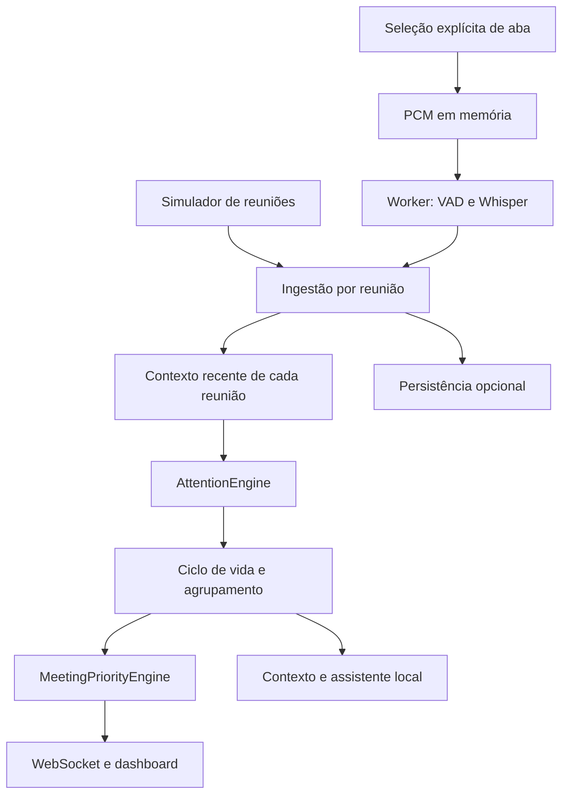

# Arquitetura

## Monorepo

- `apps/desktop`: React, seleção de áudio browser e shell Rust/Tauri.
- `apps/api`: NestJS, autenticação local, WebSocket, simulador e adaptadores infra.
- `apps/worker`: serviço STT Python independente; WAV processado em memória.
- `packages/core`: domínio TypeScript, motor, score, prioridade, catch-up, resposta,
  contratos de IA e router opcional. Não depende de browser ou Nest.
- `infra`: Compose e migration inicial.
- `tests`: dataset de regressão, lifecycle, áudio e fallback.

No modo padrão, o estado pertence a um único processo e é efêmero. Nenhum broker
ou banco é necessário para validar o produto. O modo infra aplica PostgreSQL
como registro persistente e Redis como cache; RabbitMQ transporta transcrições.
O dashboard recebe snapshots autenticados via Socket.IO e reconecta.

## Detecção

A regra local interpreta identidade com limites de palavras; filtra contexto por
120 segundos e por reunião; verifica histórico, negação e fórmulas de cortesia
antes da pergunta. Responsabilidade/expertise tornam perguntas indiretas
relevantes. Prazo e bloqueio aumentam o pedido anterior mais recente. Escala de
0–100 e pesos do usuário são determinísticos. Confiança é um indicador heurístico,
**não uma probabilidade calibrada**. As regressões não provam compreensão geral.

Eventos têm uma lista de tipos, segmentos de origem e estado. Pedido respondido,
dispensado ou expirado sai do radar. Escalada temporal atua na prioridade efetiva;
repetição e novos trechos podem gerar nova notificação só após cooldown e ganho
mínimo de 10 pontos. Não há troca automática de janela.

## Contratos

`TranscriptSegment`: meetingId e id obrigatórios, texto limitado, timestamps e
confidence validados. Id repetido não duplica evento. `Meeting[]` não depende de
A/B. `AttentionDecision` é computado sem efeitos externos. `AIProvider` não possui
ferramentas, credenciais nem acesso a ações do sistema. `AIRouter` aceita providers
injetados, timeout, circuit breaker e resultado validado; fica fora do caminho
local até a fase de adapters comerciais. Contagem/custo requer medição real do
provider antes de ser habilitada.

## Privacidade e limites operacionais

Servidor e infraestrutura ligados a 127.0.0.1. Código local aleatório por processo
ou ATTENTION_TOKEN via ambiente. O navegador mantém token na sessão. O worker
valida token e restringe CORS. Logs não imprimem transcrições. Conteúdo de reunião
é somente dado: não executa instruções, não lê secrets e não envia mensagens.

Áudio não é escrito em disco. No modo memória, transcript dura até retenção ou
reinício. No modo infra, permanece em Postgres até exclusão/limpeza; snapshots
são regravados e dados excluídos são retirados das tabelas usadas. Backups e
volumes exigem política externa. RabbitMQ pode reter mensagens em fila/DLQ;
excluir reunião no app não purga mensagem já publicada. Retenção de DLQ e limpeza
coordenada precisam de implementação antes de uso confidencial persistente.

O app não mistura áudio do sistema tentando separá-lo depois. Captura individual
é responsabilidade de cada `AudioSource`. System/Application são interfaces
preparadas, sem implementação nativa nesta entrega.
